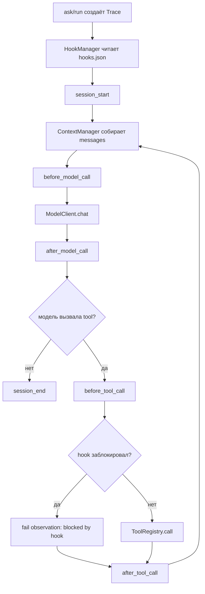

# Пользовательские hooks

Hooks — это небольшая точка расширения `madharness-mini`: харнесс сам создаёт
события жизненного цикла `ask` и `run`, а проект может подключить локальные
обработчики через `.madharness-mini/hooks.json`.

Механизм уже встроен в текущий код. Это не глобальный event bus и не фреймворк
плагинов: `loop.py` и `model_loop.py` явно вызывают `HookManager.emit()` в
нескольких местах, а manager синхронно запускает подходящие command hooks.

Если `.madharness-mini/hooks.json` отсутствует, hooks выключены и запуск ведёт
себя как раньше.

## Где живёт код

| Модуль | Роль |
| --- | --- |
| `madharness_mini/hooks/types.py` | Публичные типы `HookEvent`, `HookDecision`, `HookProvider` и список событий. |
| `madharness_mini/hooks/config.py` | Читает `.madharness-mini/hooks.json` и проверяет поля обработчиков. |
| `madharness_mini/hooks/commands.py` | Запускает пользовательские команды через `subprocess.run([...], shell=False)`. |
| `madharness_mini/hooks/manager.py` | Синхронно вызывает hooks по порядку, пишет hook-события в trace и возвращает первое блокирующее решение. |
| `madharness_mini/hooks/redaction.py` | Обрезает большие payload и прячет очевидные секретные поля перед передачей в hook. |

Точки подключения:

| Файл | Что делает |
| --- | --- |
| `madharness_mini/loop.py` | Создаёт `HookManager` в `ask()` и `run_agent()`, отправляет `session_start`, `session_end`, `session_error`, model events для `ask`. |
| `madharness_mini/model_loop.py` | Отправляет model/tool lifecycle events и применяет блокировку `before_tool_call`. |
| `madharness_mini/subagents/runner.py` | Передаёт те же hooks в дочерний trace субагента через `with_trace()`. |

## Поток выполнения



Главное правило: только `before_tool_call` может остановить действие. Остальные
events нужны для аудита, логирования и внешней автоматизации.

Если hook блокирует tool, handler инструмента не запускается. Харнесс создаёт
обычное observation:

```json
{
  "ok": false,
  "tool": "run_shell",
  "summary": "blocked by hook: команда удаления запрещена",
  "hook_blocked": true
}
```

После этого всё идёт штатным путём: observation пишется в trace, отправляется в
контекст модели как результат tool call, а затем вызывается `after_tool_call`.

## Формат hooks.json

Файл лежит рядом с обычным конфигом проекта:

```text
.madharness-mini/hooks.json
```

Минимальный пример:

```json
{
  "hooks": [
    {
      "id": "deny-shell",
      "event": "before_tool_call",
      "match": { "tool": "run_shell" },
      "command": "python3",
      "args": ["scripts/hooks/deny_shell.py"],
      "cwd": ".",
      "timeout_seconds": 3
    }
  ]
}
```

Поля одного hook:

| Поле | Обязательность | Смысл |
| --- | --- | --- |
| `id` | Да | Короткое безопасное имя для trace. Разрешены ASCII-буквы, цифры, `_`, `-`, `.`. |
| `event` | Да | Событие харнесса, например `before_tool_call`. |
| `command` | Да | Исполняемая команда. Запускается без shell. |
| `args` | Нет | Список строковых аргументов. По умолчанию пустой список. |
| `cwd` | Нет | Рабочий каталог внутри workspace. По умолчанию `"."`. |
| `env` | Нет | Явные переменные окружения для hook-команды. |
| `match` | Нет | Exact-match по полям события. |
| `timeout_seconds` | Нет | Таймаут одного hook. По умолчанию `5`. |
| `enabled` | Нет | Если значение не `true`, hook пропускается. По умолчанию включён. |

`match` намеренно простой: это не язык правил. Значения сравниваются как
точное равенство. Для `kind` сравнение идёт с типом запуска (`ask`, `run`,
`subagent`), для остальных ключей — с `event.data`.

Примеры:

```json
{ "match": { "tool": "read_file" } }
```

```json
{ "match": { "kind": "subagent" } }
```

```json
{ "match": { "tool": ["write_file", "apply_patch", "run_shell"] } }
```

## События

| Event | Когда вызывается | Важные поля `data` |
| --- | --- | --- |
| `session_start` | После создания trace и загрузки hooks. | `task_preview`, `cwd`; у субагента также `subagent`, `parent_trace_id`. |
| `before_model_call` | Перед HTTP-вызовом модели. | `turn`, `tools_count`, `context_report`. |
| `after_model_call` | После ответа модели. | `turn`, `message.content_preview`, `message.tool_calls_count`, `message.tools`. |
| `before_tool_call` | После разбора имени tool и аргументов, до handler. | `turn`, `call_id`, `tool`, `args`. |
| `after_tool_call` | После observation инструмента. | `turn`, `tool`, `args`, `observation`. |
| `session_end` | При нормальном финале, max turns или контролируемом вопросе пользователю. | `status`, `turns`, `result_preview`. |
| `session_error` | При ошибке сессии, которую харнесс пробрасывает наружу. | `turn`, `error_type`, `message`. |

`kind` не лежит внутри `data`; он находится рядом с event:

| `kind` | Значение |
| --- | --- |
| `ask` | Один model call без tools. |
| `run` | Основной агентский цикл. |
| `subagent` | Дочерний агентский цикл markdown-субагента. |

## JSON-контракт hook-команды

Харнесс передаёт событие в stdin одной JSON-структурой:

```json
{
  "version": 1,
  "event": "before_tool_call",
  "kind": "run",
  "trace_id": "20260529-171000-abc12345",
  "data": {
    "turn": 0,
    "call_id": "call_1",
    "tool": "run_shell",
    "args": {
      "command": "pwd"
    }
  }
}
```

Пустой stdout означает “разрешить”:

```python
import json
import sys

event = json.load(sys.stdin)
# аудит, логирование, внешняя проверка
```

Можно вернуть JSON:

```json
{ "ok": true, "message": "logged" }
```

Для блокировки:

```json
{ "ok": false, "block": "Команда shell запрещена правилами проекта" }
```

Поле `message` попадает в `hook_finished`, а поле `block` — в `hook_blocked` и
в summary observation.

## Пример guard hook

Такой hook запрещает читать один файл и удалять файлы через shell:

```python
import json
import shlex
import sys

event = json.load(sys.stdin)
data = event.get("data", {})
tool = data.get("tool")
args = data.get("args", {})

if tool == "read_file" and args.get("path") == "data/secret.txt":
    print(json.dumps({"ok": False, "block": "секретный файл нельзя читать"}))
elif tool == "run_shell" and shlex.split(args.get("command", ""))[0] == "rm":
    print(json.dumps({"ok": False, "block": "удаление файлов запрещено"}))
else:
    print(json.dumps({"ok": True, "message": "allowed"}))
```

Конфиг для него:

```json
{
  "hooks": [
    {
      "id": "guard-dangerous-tools",
      "event": "before_tool_call",
      "command": "python3",
      "args": ["scripts/hooks/guard_tool.py"],
      "cwd": ".",
      "timeout_seconds": 3
    }
  ]
}
```

## Trace

Hooks пишут события в тот же JSONL trace, что и model/tool loop:

| Trace event | Когда появляется |
| --- | --- |
| `hook_started` | Перед запуском подходящего hook. |
| `hook_finished` | Hook успешно разрешил действие или просто записал аудит. |
| `hook_blocked` | Hook вернул `ok: false` или `block`. |
| `hook_failed` | Hook упал, вернул невалидный JSON, завершился с non-zero code или вышел по timeout. |

Ошибки observe-hooks не ломают запуск. Если `before_model_call` hook упал, trace
получит `hook_failed`, но модель всё равно будет вызвана. Блокировка возможна
только через валидный JSON-ответ на `before_tool_call`.

В trace tool call с блокировкой выглядит как обычное `tool_observation` с
`ok=false` и `hook_blocked=true`. Это важно: модель не получает отдельный новый
протокол, а видит привычный результат инструмента.

## Субагенты

При `delegate_task` дочерний запуск получает те же provider-ы hooks, но с новым
дочерним trace. Поэтому:

- родительский trace видит `delegate_task` как обычный tool call;
- дочерний trace видит `kind: "subagent"` в hook events;
- `match: { "kind": "subagent" }` позволяет писать правила только для
  субагентов;
- block в дочернем `before_tool_call` работает так же, как в parent loop.

## Безопасность

Hook-команда — доверенный локальный код проекта. Харнесс не превращает её в
песочницу, но держит несколько важных границ:

- команда и аргументы запускаются списком, без shell-строки;
- `cwd` проходит через `Policy.safe_path()` и должен быть директорией внутри
  workspace;
- переменные `MADHARNESS_MINI_*` не наследуются автоматически;
- наследуется только безопасный минимум окружения (`PATH`, `HOME`, `TMPDIR` и
  похожие системные переменные);
- секреты нужно передавать hook-у только явно через `env`;
- payload перед отправкой обрезается и проходит через redaction: поля вроде
  `api_key`, `*_token`, `password`, `secret` заменяются на `<redacted>`.

Hooks не заменяют `Policy`: политика по-прежнему защищает workspace и опасные
shell-команды. Hooks добавляют проектные правила поверх общей политики, например
“не читать `data/secret.txt`”, “запретить `run_shell` в пятницу” или “логировать
все `apply_patch`”.

## Поведение при ошибках

| Ситуация | Что делает харнесс |
| --- | --- |
| `hooks.json` отсутствует | Создаётся пустой manager, events никуда не отправляются. |
| `hooks.json` невалидный | Запуск завершается ошибкой конфигурации. |
| Hook не подходит по `event` или `match` | Он пропускается. |
| Hook завершился с non-zero code | Пишется `hook_failed`, запуск продолжается. |
| Hook вернул невалидный JSON | Пишется `hook_failed`, запуск продолжается. |
| Hook превысил timeout | Пишется `hook_failed`, запуск продолжается. |
| Hook вернул `ok: false` на `before_tool_call` | Tool handler не запускается, модель получает fail-observation. |
| Hook вернул `ok: false` на другом событии | Manager запишет `hook_blocked`, но сейчас это имеет смысл только как диагностика; врезки, кроме `before_tool_call`, не меняют ход выполнения. |

## Что проверять тестами

Минимальный набор сценариев уже покрыт в `tests/test_hooks.py`:

- без `hooks.json` manager работает как no-op;
- `before_tool_call` блокирует tool до вызова handler;
- падение hook-процесса пишется в trace и не ломает `ask`;
- hook не наследует `MADHARNESS_MINI_API_KEY`.

Для ручной проверки удобно создать маленький проект с `hooks.json`, который
блокирует чтение одного файла и попытку удаления через `run_shell`, затем
посмотреть trace: там должны быть `hook_started`, `hook_blocked` и
`tool_observation` с `hook_blocked=true`.
